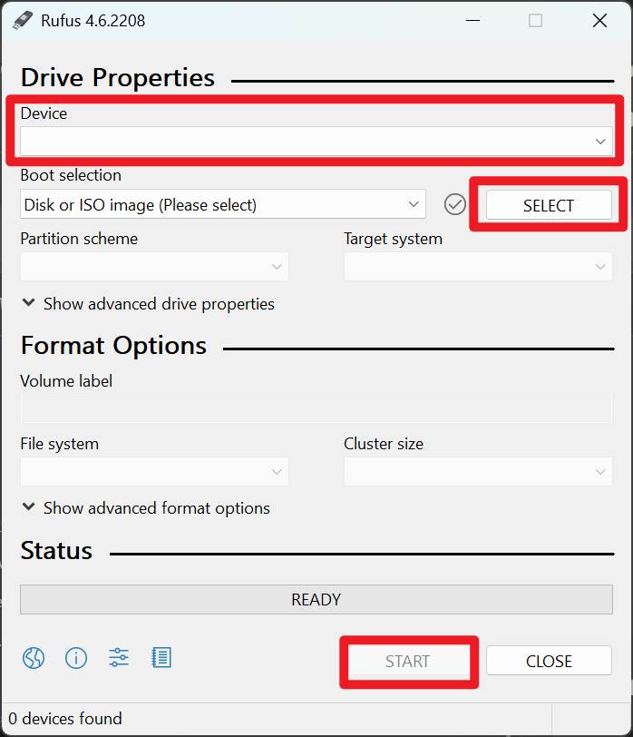

# Set up Linux

## Choose your favorite distro
作为开源系统，Linux有诸多发行版本。选择你喜欢的版本或最受欢迎的版本（如Ubuntu, 更容易解决遇到的问题）即可。

### 选择桌面环境
桌面环境即是你将直接看到的图形界面。无论选择何种发行版本，KDE和Gnome都是最受欢迎的选项。比较它们不同的风格做出选择。桌面环境可以在安装后更换。

## Start installation
### 制作安装介质
在官方网站或镜像站（清华源：https://mirrors.tuna.tsinghua.edu.cn）下载iso映像文件


iso文件分为在线安装版和离线安装版。
- 在线安装版体积较小，安装时选项较多，但要求安装时联网。而且由于你需要在进入系统前联网，你不能进行复杂的设置，很可能需要有线网络连接。
- 离线安装版体积较大，下载时可能需要选择相应的桌面环境，仍然建议安装时联网以便获取更新、配置源以及安装额外软件。

准备一个至少8GB的U盘，下载刻录工具（免费免安装的rufus： https://rufus.ie/）


选择U盘和刚下载的iso文件，点击开始，稍等片刻，当进度条显示ready时制作完成，弹出U盘。

## Install neccessary software

>⚠️ 以下安装软件的命令基于apt包管理器，适用于debian, ubuntu, linuxmint等，其他系统可能使用不同的包管理器，命令和包名称有所不同，需查询。

### 中文输入法

若系统自带ibus或旧版的fcitx，卸载系统自带的输入法
```bash
sudo apt purge fcitx*
sudo apt purge ibus*
sudo apt autoremove
```

安装fcitx5拼音输入法

```bash
sudo apt install fcitx5 fcitx5-pinyin fcitx5-config-qt
```

设置为默认
```bash
im-config -n fcitx5
```

使更改生效
```bash
source ~/.profile
```

重新启动后才可以成功打出汉字

### 开机自动挂载磁盘
当你的系统有多个硬盘或分区时，可能需要在开机时自动挂载它们。Linux通过`/etc/fstab`文件来配置开机自动挂载。

#### 查看硬盘信息
首先查看系统中的硬盘和分区信息

```bash
lsblk
```

或者查看UUID信息（推荐使用UUID挂载，更稳定）

```bash
sudo blkid
```

#### 创建挂载点
为要挂载的硬盘创建目录

```bash
sudo mkdir /mnt/data  #data可改为你喜欢的硬盘名称
```

#### 编辑fstab文件
编辑`/etc/fstab`文件来配置自动挂载

```bash
sudo nano /etc/fstab
```

在文件末尾添加挂载配置，格式如下：
```
UUID=your-disk-uuid /mnt/data ext4 defaults 0 2
```

参数说明：
- `UUID=your-disk-uuid`: 硬盘的UUID（从blkid命令获取）
- `/mnt/data`: 挂载点路径，应与之前创建的目录一致
- `ext4`: 文件系统类型（根据实际情况可能是ntfs、fat32等，但建议将硬盘格式化为ext4）
- `defaults`: 挂载选项
- `0`: dump选项（通常为0）
- `2`: fsck检查顺序（根分区为1，其他为2，不检查为0）

#### 测试挂载配置
保存文件后，测试配置是否正确

```bash
sudo mount -a
```

如果没有错误信息，说明配置正确。可以用以下命令查看挂载状态：

```bash
df -h
```

重启系统后，硬盘将自动挂载到指定位置。


### winscp (optional)
使用你的windows电脑查看/linux上的文件，或将新的文件复制进来。
接下来需要进入到Ubuntu中，查看一下是否开启OpenSSH服务

```bash
sudo systemctl status ssh
```

如果未安装ssh，需要安装ssh服务

```bash
sudo apt install openssh-server
```

安装后，启动ssh服务

```bash
sudo systemctl start ssh
```
然后再检查一下ssh服务状态，显示active就说明已经安装成功

此时从windows端WinSCP新建连接，选择SFTP协议，输入linux设备的ip和用户名密码即可进入linux文件系统。

## Handling problems

### 界面显示异常
睡眠唤醒后屏幕画面撕裂或花屏，重启显示管理器：

想办法进入终端，执行以下命令之一：
```bash
#KDE 通常采用SDDM：
sudo systemctl restart sddm 

#Gnome 通常采用GDM
sudo systemctl restart gdm 

#其他可能采用lightdm
sudo systemctl restart lightdm
```
